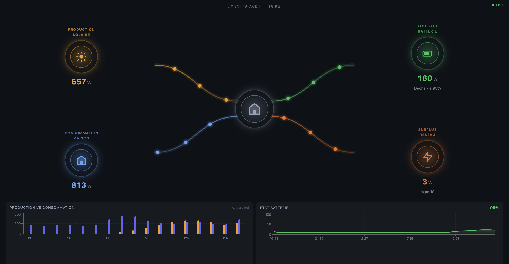

# Énergie Maison — Home Energy Dashboard

A real-time home energy dashboard built for an **iPad Mini mounted on a wall**, connecting directly to Home Assistant. Displays live solar production, house consumption, battery storage, and grid exchange — with animated energy flow lines and 7-day history charts.

---



---

## Features

- **Real-time energy flows** — animated particles travelling between Solar, Battery, House, and Grid nodes, speed proportional to wattage
- **Live Home Assistant data** — WebSocket connection, updates instantly on state change
- **7-day history charts** — Production vs Consumption bar chart, Battery SoC area chart, stored locally on the server
- **Full kiosk mode** — no browser chrome, no sidebar, designed for a wall-mounted iPad
- **iOS 12 compatible** — works on old iPad Mini (iOS 12.5.8 / Safari 12)
- **Add to Home Screen** — installs as a standalone app with custom icon and name

---

## Architecture

```
┌─────────────────────────────────────────────────────┐
│                    iPad / Browser                    │
│                                                     │
│  ┌─────────────────┐      ┌──────────────────────┐  │
│  │  React Frontend │ ───► │  /api/local-history   │  │
│  │  (live data)    │      │  (7-day chart data)   │  │
│  └────────┬────────┘      └──────────────────────┘  │
│           │ WebSocket                                │
└───────────┼─────────────────────────────────────────┘
            │                        ▲
            ▼                        │ HTTP (every 60s)
┌─────────────────────┐   ┌──────────────────────────┐
│   Home Assistant    │   │      server.js (Node)     │
│   :8123             │   │  serves dist/ + history   │
│                     │   │  writes data/history.json │
└─────────────────────┘   └──────────────────────────┘
```

- **Real-time:** browser connects directly to HA via WebSocket (`home-assistant-js-websocket`)
- **History:** `server.js` polls HA every 60s, stores a rolling 7-day window in `data/history.json`, exposes `GET /api/local-history`
- **`data/`** is gitignored — runtime only, persists across server restarts

---

## Energy Formula

```
Consumption = Solar + Grid + Battery
```

| Sensor | Sign convention |
|---|---|
| Grid | `+` = importing, `−` = exporting |
| Battery | `+` = discharging, `−` = charging |

---

## Tech Stack

| Layer | Technology |
|---|---|
| Frontend | React 18 + Vite 5 |
| Styling | Inline CSS (Tailwind 4 base reset only — iOS 12 constraint) |
| Animations | RAF + SVG `getPointAtLength()` — no SMIL |
| Charts | Recharts (fixed dimensions — no `ResizeObserver`) |
| HA connection | `home-assistant-js-websocket` |
| Legacy build | `@vitejs/plugin-legacy` targeting `ios >= 12, safari >= 12` |
| Server | Node.js (no framework) |

---

## Prerequisites

- **Node.js** 18+ on your server/Mac
- A **Home Assistant** instance accessible on the local network
- A **Long-Lived Access Token** from HA (Settings → Profile → Security)

---

## Installation

### 1. Clone the repository

```bash
git clone https://github.com/jeremyDevios/HomeAssistantIpadMini.git
cd HomeAssistantIpadMini
npm install
```

### 2. Configure environment

Create a `.env` file at the project root (never committed):

```bash
VITE_HA_URL=http://192.168.1.145:8123
VITE_HA_TOKEN=your_long_lived_access_token_here
```

> Get your token in HA at **Settings → Profile → Security → Long-Lived Access Tokens → Create Token**

### 3. (Optional) Seed 7 days of simulated history

If you want charts populated immediately without waiting for real data to accumulate:

```bash
npm run seed
```

This generates 10,080 samples (1/min × 7 days) with realistic solar curves, weather variation, battery dispatch, and consumption profiles. Real data will overwrite it progressively once the server runs.

---

## Running

### Development (Mac only — not for iPad testing)

```bash
npm run dev
```

> ⚠️ The dev server does **not** apply legacy transforms. iOS 12 Safari will show a blank page. Use `npm run serve` for iPad testing.

### Production / iPad

```bash
npm run serve
```

This builds the app with iOS 12 legacy transforms, then starts the server on port **4173**.

Open on the iPad:
```
http://<your-mac-or-server-ip>:4173
```

Find your IP:
```bash
ipconfig getifaddr en0
```

### Start server only (when dist/ is already built)

```bash
npm start
```

---

## Home Assistant Entity Mapping

Edit `src/lib/useHassData.js` to match your HA entity IDs:

| Variable | Default entity ID | Description |
|---|---|---|
| `ENTITY_SOLAR` | `sensor.production_solaire` | Solar production (W, always positive) |
| `ENTITY_GRID` | `sensor.house_power_channel_1_power` | Grid power (W, + import / − export) |
| `ENTITY_BATTERY` | `sensor.energy_battery_solarflow1600_…` | Battery net power (W, + discharge / − charge) |
| `ENTITY_SOC` | `sensor.solarflow1600_electric_level` | Battery state of charge (%) |

---

## Add to Home Screen (iPhone / iPad)

1. Open the dashboard URL in **Safari**
2. Tap the **Share** button (⎙)
3. Tap **"Sur l'écran d'accueil"** (Add to Home Screen)
4. Confirm — the app appears with the custom icon and launches in full-screen kiosk mode

---

## Project Structure

```
.
├── public/
│   └── Logo.png              # App icon (favicon + iOS home screen)
├── Screenshot/
│   └── Dashboard.png         # UI screenshot
├── Prototype/
│   └── image.png             # Original design reference
├── scripts/
│   └── seed-history.js       # Generates 7 days of simulated history
├── src/
│   ├── components/
│   │   ├── EnergyNode.jsx    # Individual energy node (solar/battery/grid/house)
│   │   ├── FlowCanvas.jsx    # SVG animated particle flows (RAF + getPointAtLength)
│   │   ├── FlowDiagram.jsx   # Assembles nodes + canvas
│   │   ├── ProductionChart.jsx  # Production vs Consumption bar chart
│   │   └── BatteryChart.jsx     # Battery SoC area chart
│   ├── lib/
│   │   ├── mockData.js       # Static mock data + color palette
│   │   ├── useHassData.js    # HA WebSocket hook (real-time)
│   │   └── useLocalHistory.js   # Local history API hook (charts)
│   ├── App.jsx
│   └── main.jsx
├── server.js                 # Node HTTP server + HA data logger
├── data/                     # Runtime only — gitignored
│   └── history.json          # 7-day rolling history
├── .env                      # Secrets — gitignored, create manually
├── index.html
├── vite.config.js
└── package.json
```

---

## Available Scripts

| Script | Description |
|---|---|
| `npm run dev` | Vite dev server (Mac only, no iOS 12 support) |
| `npm run build` | Production build with legacy transforms |
| `npm run serve` | Build + start server on LAN |
| `npm start` | Start server only (dist/ must exist) |
| `npm run seed` | Generate 7 days of simulated history data |

---

## iOS 12 Compatibility Notes

This app is specifically engineered for **Safari 12 on iOS 12.5.8**:

- No SVG SMIL animations — uses `requestAnimationFrame` + `getPointAtLength()`
- No `backdrop-filter`, `gap`, `clamp()`, `aspect-ratio` CSS
- All layout via inline `style={{}}` props (Tailwind utility classes silently ignored on iOS 12)
- Recharts uses explicit pixel dimensions — no `ResizeObserver`
- Build output includes a full legacy bundle + polyfills via `@vitejs/plugin-legacy`

---

## License

MIT
